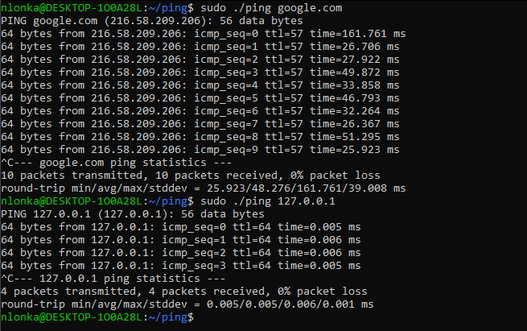

<a id="readme-top"></a>

<div align="center">
  <h2 align="center">ping</h3>
</div>

<details>
  <summary>Table of Contents</summary>
  <ol>
    <li>
      <a href="#about-the-project">About the project</a>
    </li>
    <li>
      <a href="#getting-started">Getting started</a>
      <ul>
        <li><a href="#prerequisites">Prerequisites</a></li>
        <li><a href="#how-to-run-it">How to run it</a></li>
      </ul>
    </li>
    <li>
      <a href="#potential-improvements">Potential improvements</a>
    </li>
  </ol>
</details>


<!-- ABOUT THE PROJECT -->
## About the project



This was the first project on my personal 10-day [hackathon](https://github.com/Rubidium7/hackathon) to learn about cryptography, and coding in rust, and to deepen my knowledge about network protocols and TLS/SSL.

It's a simple implementation of the ping command, you give as an argument either the domain or an ip address of a host and the program will ping it once a second and print the results. 

<!-- GETTING STARTED -->
## Getting started

This is how you might run this program locally.
Do note that it was originally made for a unix system, so your mileage may vary depending on your machine. 

### Prerequisites

As this program is coded in C, so you need to have gcc installed to compile it

### How to run it

```
git clone https://github.com/Rubidium7/ping.git
cd ping
make && sudo ./ping <domain/ip_address>
```
Note: the program creates a raw socket which it'll need sudo access for

## Potential improvements

As this project was written for a hackathon I purely focused on getting an MVP out, but if I come back to this here would be some nice feature ideas

- [ ] support for flags
  - [ ] -?
  - [ ] -v
  - [ ] -f
  - [ ] -w
  - [ ] -l
  - [ ] etc.
- [ ] error handling that mimics the original gnu ping
   

<!-- ROADMAP -->
<!--## Roadmap

- [ ] Feature 1
- [ ] Feature 2
- [ ] Feature 3
    - [ ] Nested Feature -->


<p align="right">(<a href="#readme-top">back to top</a>)</p>
